# 口袋48消息详细处理流程图

## 1. 整体架构流程

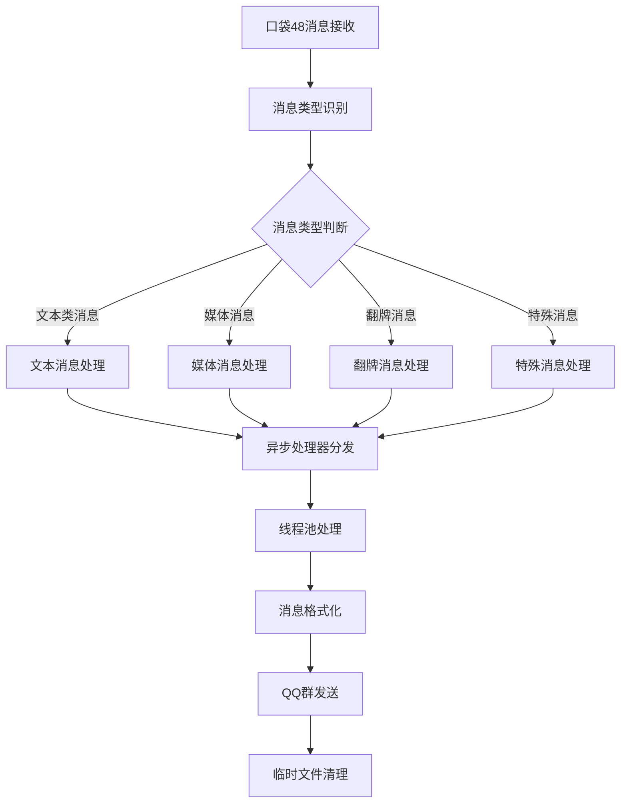

## 2. 消息类型分类

### 2.1 支持的消息类型

| 类型 | 枚举值 | 描述 | 处理复杂度 |
|------|--------|------|------------|
| 文本消息 | TEXT | 普通文本消息 | 低 |
| 礼物文本 | GIFT_TEXT | 礼物相关文本 | 低 |
| 音频消息 | AUDIO | 语音消息 | 高 |
| 图片消息 | IMAGE | 图片消息 | 中 |
| 视频消息 | VIDEO | 视频消息 | 高 |
| 表情消息 | EXPRESSIMAGE | 口袋表情 | 中 |
| 回复消息 | REPLY | 普通回复 | 低 |
| 礼物回复 | GIFTREPLY | 礼物回复 | 低 |
| 直播推送 | LIVEPUSH | 直播开始推送 | 中 |
| 直播分享 | SHARE_LIVE | 直播分享 | 低 |
| 翻牌消息 | FLIPCARD | 翻牌文本回复 | 低 |
| 翻牌音频 | FLIPCARD_AUDIO | 翻牌语音回复 | 高 |
| 翻牌视频 | FLIPCARD_VIDEO | 翻牌视频回复 | 高 |
| 口令红包 | PASSWORD_REDPACKAGE | 口令红包 | 低 |
| 投票消息 | VOTE | 投票活动 | 低 |
| 帖子分享 | SHARE_POSTS | 分享帖子 | 低 |
| 代理聊天 | AGENT_QCHAT_TEXT | 代理聊天文本 | 低 |
| 代理礼物 | AGENT_QCHAT_GIFT_REPLY | 代理聊天礼物回复 | 低 |
| 翻牌文本 | FAIPAI_TEXT | 翻牌文本 | 低 |
| 未知类型 | UNKNOWN | 未知消息类型 | 低 |

## 3. 详细处理流程

### 3.1 文本消息处理流程

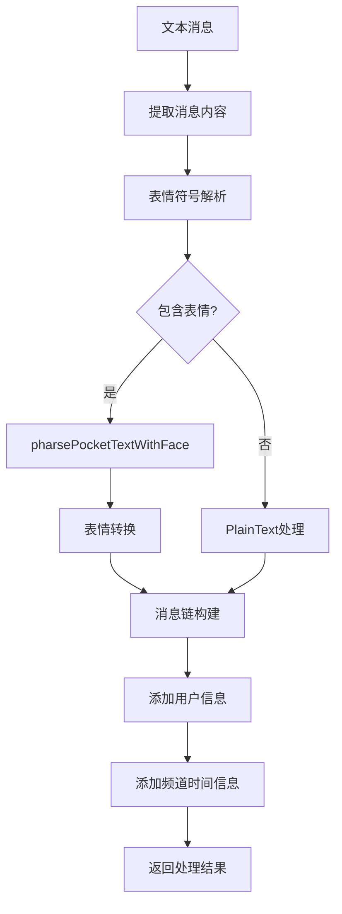

### 3.2 音频消息处理流程

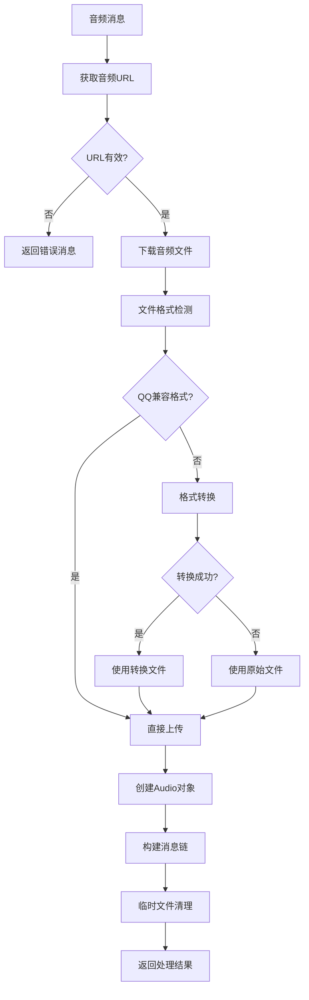

### 3.3 视频消息处理流程

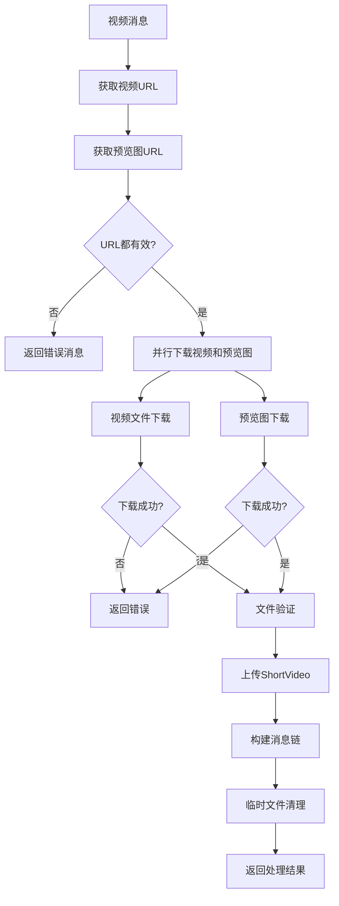

### 3.4 图片消息处理流程

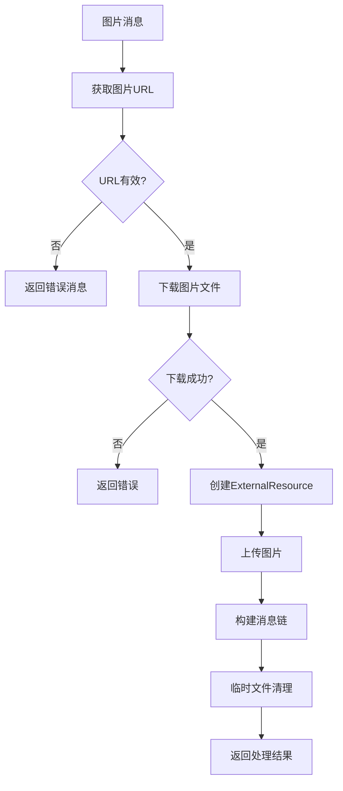

### 3.5 翻牌音频处理流程

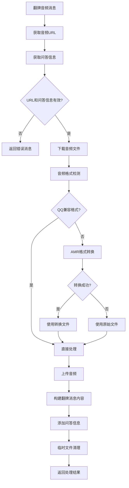

### 3.6 翻牌视频处理流程

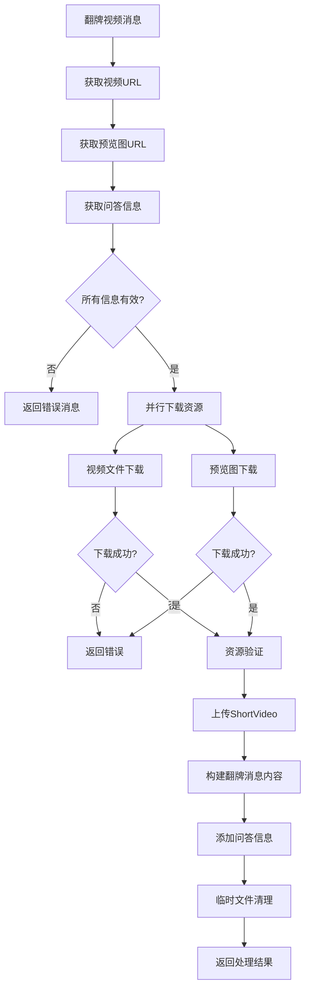

### 3.7 直播推送处理流程

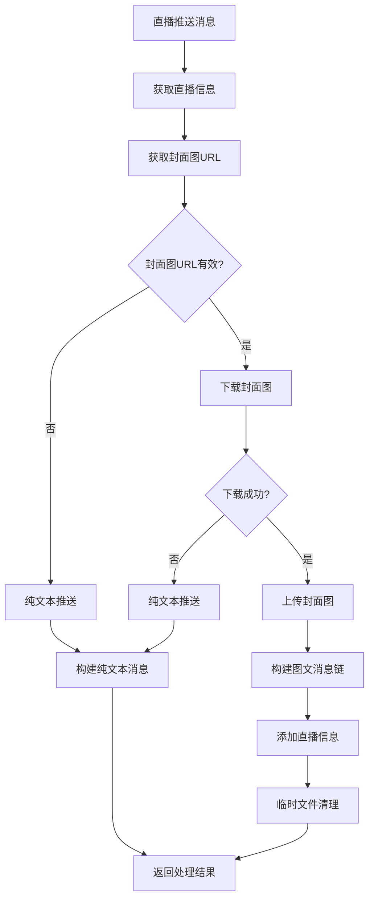

## 4. 异步处理架构

### 4.1 线程池配置

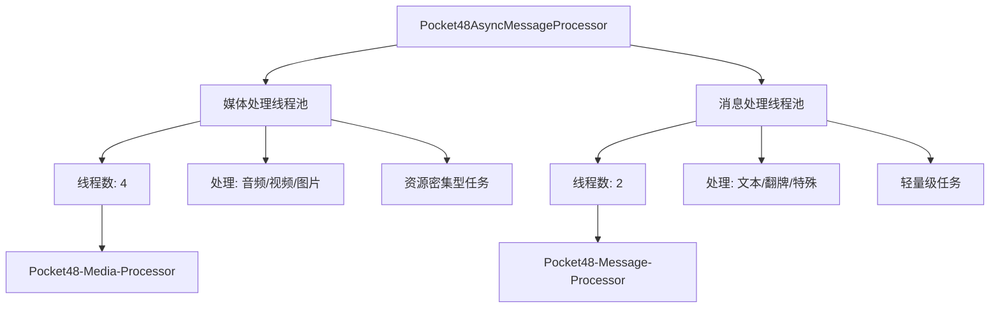

### 4.2 异步处理流程

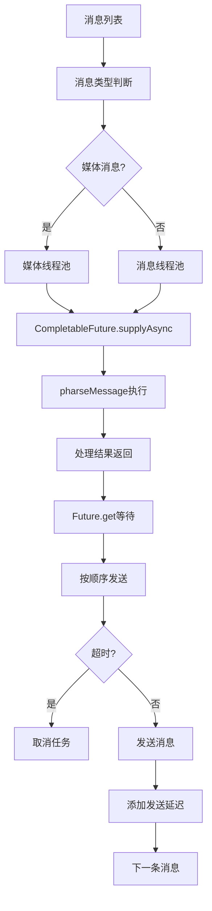

## 5. 错误处理机制

### 5.1 网络错误处理

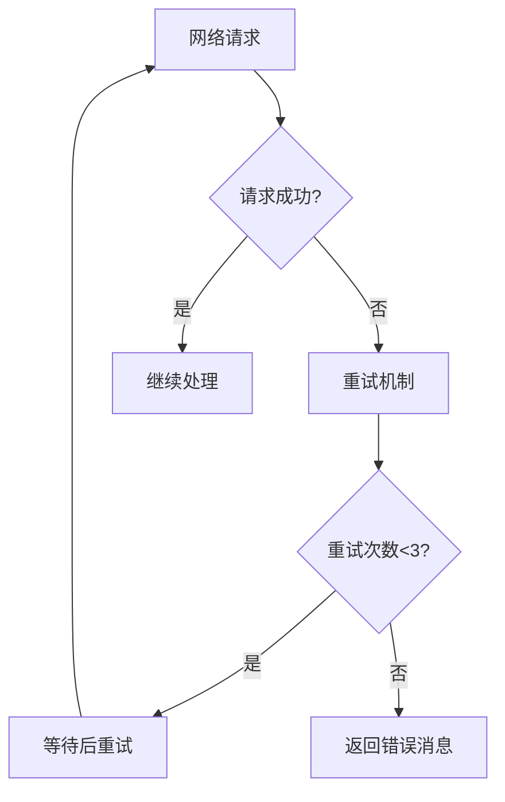

### 5.2 文件处理错误

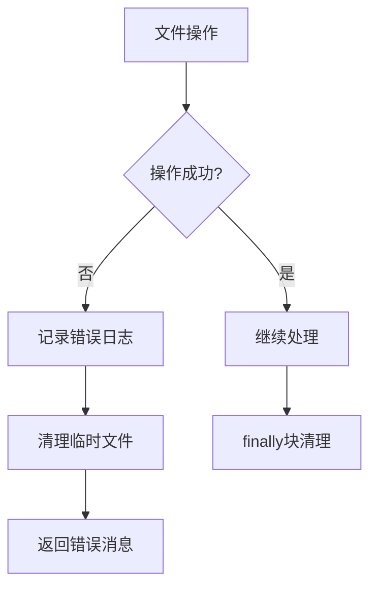

### 5.3 格式转换错误

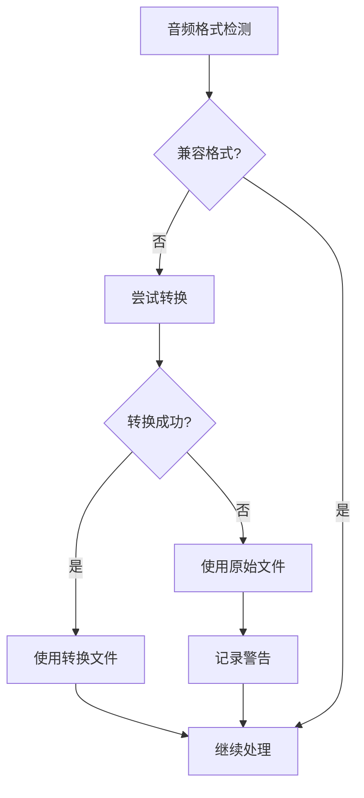

## 6. 性能优化特性

### 6.1 资源管理
- **临时文件自动清理**: 每次处理完成后自动删除临时文件
- **ExternalResource管理**: 使用try-with-resources确保资源释放
- **线程池管理**: 合理配置线程池大小，避免资源浪费

### 6.2 并发处理
- **异步消息处理**: 使用CompletableFuture实现异步处理
- **分类线程池**: 媒体和文本消息使用不同线程池
- **超时控制**: 设置处理超时时间，避免长时间阻塞

### 6.3 缓存机制
- **消息缓存**: 避免重复处理相同消息
- **资源重用**: 合理重用下载的资源

## 7. 安全特性

### 7.1 输入验证
- **URL有效性检查**: 验证所有外部URL
- **文件类型验证**: 检查下载文件的类型和格式
- **大小限制**: 控制下载文件的大小

### 7.2 异常处理
- **全面异常捕获**: 每个处理步骤都有异常处理
- **错误日志记录**: 详细记录错误信息便于调试
- **优雅降级**: 处理失败时提供备用方案

## 8. 扩展性设计

### 8.1 消息类型扩展
- **枚举设计**: 使用枚举定义消息类型，便于扩展
- **UNKNOWN类型**: 预留未知类型处理
- **插件化处理**: 每种消息类型独立处理逻辑

### 8.2 处理器扩展
- **接口设计**: 核心处理逻辑通过接口定义
- **配置化**: 线程池大小等参数可配置
- **模块化**: 不同功能模块独立，便于维护

## 9. 监控和调试

### 9.1 日志系统
- **分级日志**: 区分信息、警告、错误日志
- **详细追踪**: 记录每个处理步骤的详细信息
- **性能监控**: 记录处理时间和资源使用情况

### 9.2 调试支持
- **文件路径记录**: 记录所有临时文件路径
- **格式检测信息**: 详细记录音频格式检测结果
- **网络请求追踪**: 记录所有网络请求的详细信息

---

*本流程图基于当前代码实现，展示了口袋48消息处理的完整流程和技术细节。*