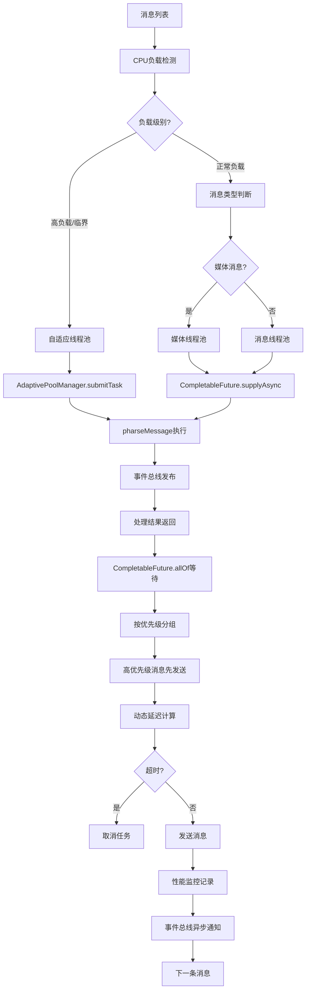
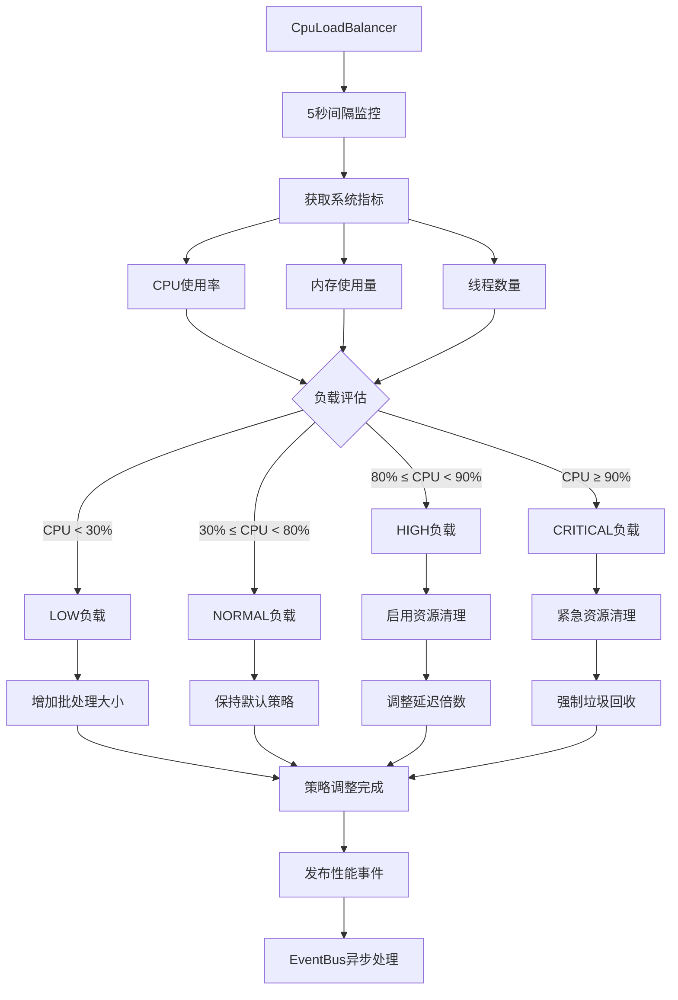
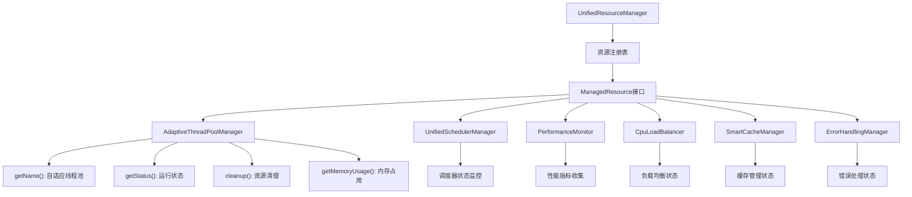
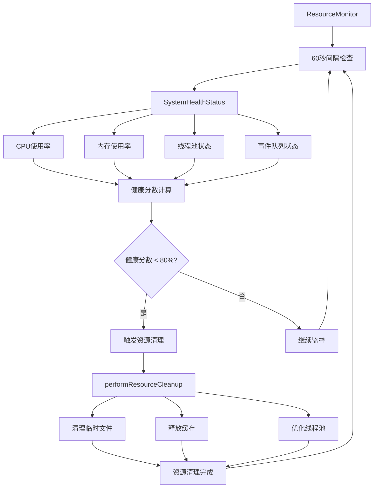
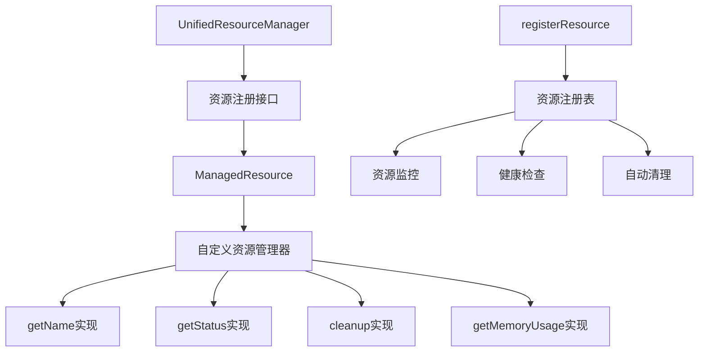
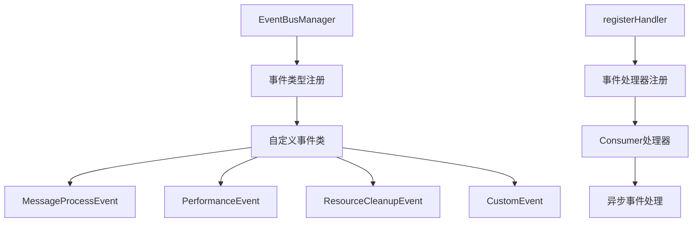

# 口袋48消息详细处理流程图

## 1. 整体架构流程


## 2. 消息类型分类

### 2.1 支持的消息类型

| 类型 | 枚举值 | 描述 | 处理复杂度 |
|------|--------|------|------------|
| 文本消息 | TEXT | 普通文本消息 | 低 |
| 礼物文本 | GIFT_TEXT | 礼物相关文本 | 低 |
| 音频消息 | AUDIO | 语音消息 | 高 |
| 图片消息 | IMAGE | 图片消息 | 中 |
| 视频消息 | VIDEO | 视频消息 | 高 |
| 表情消息 | EXPRESSIMAGE | 口袋表情 | 中 |
| 回复消息 | REPLY | 普通回复 | 低 |
| 礼物回复 | GIFTREPLY | 礼物回复 | 低 |
| 直播推送 | LIVEPUSH | 直播开始推送 | 中 |
| 直播分享 | SHARE_LIVE | 直播分享 | 低 |
| 翻牌消息 | FLIPCARD | 翻牌文本回复 | 低 |
| 翻牌音频 | FLIPCARD_AUDIO | 翻牌语音回复 | 高 |
| 翻牌视频 | FLIPCARD_VIDEO | 翻牌视频回复 | 高 |
| 口令红包 | PASSWORD_REDPACKAGE | 口令红包 | 低 |
| 投票消息 | VOTE | 投票活动 | 低 |
| 帖子分享 | SHARE_POSTS | 分享帖子 | 低 |
| 代理聊天 | AGENT_QCHAT_TEXT | 代理聊天文本 | 低 |
| 代理礼物 | AGENT_QCHAT_GIFT_REPLY | 代理聊天礼物回复 | 低 |
| 翻牌文本 | FAIPAI_TEXT | 翻牌文本 | 低 |
| 未知类型 | UNKNOWN | 未知消息类型 | 低 |

## 3. 详细处理流程

### 3.1 文本消息处理流程


### 3.2 音频消息处理流程


### 3.3 视频消息处理流程


### 3.4 图片消息处理流程


### 3.5 翻牌音频处理流程


### 3.6 翻牌视频处理流程


### 3.7 直播推送处理流程


## 4. 统一资源管理架构

### 4.1 核心架构组件

```mermaid
flowchart TD
    A[UnifiedResourceManager] --> B[AdaptiveThreadPoolManager]
    A --> C[UnifiedSchedulerManager]
    A --> D[EventBusManager]
    A --> E[PerformanceMonitor]
    A --> F[CpuLoadBalancer]
    A --> G[SmartCacheManager]
    A --> H[ErrorHandlingManager]
    
    B --> I["自适应线程池(2-4核心)"]
    B --> J["CPU使用率监控"]
    B --> K["动态调整机制"]
    
    C --> L["全局调度器(2核心)"]
    C --> M["任务分类管理"]
    C --> N["并发限制(10任务)"]
    
    D --> O["事件处理器(1-3线程)"]
    D --> P["异步事件队列"]
    D --> Q["性能事件监控"]
    
    E --> R["查询统计"]
    E --> S["内存监控"]
    E --> T["性能指标"]
    
    F --> U["负载级别检测"]
    F --> V["动态延迟调整"]
    F --> W["策略切换"]
    
    G --> X["智能缓存"]
    G --> Y["自动清理"]
    
    H --> Z["异常处理"]
    H --> AA["错误恢复"]
```



### 4.2 线程池配置策略


### 4.3 事件驱动处理流程



### 4.4 CPU负载均衡策略



### 4.5 事件总线机制

```mermaid
flowchart TD
    A[事件发布] --> B[EventBusManager]
    B --> C{同步/异步?}
    
    C -->|同步| D[直接处理]
    C -->|异步| E[加入事件队列]
    
    E --> F[事件队列(1000容量)]
    F --> G[事件处理线程池(1-3线程)]
    
    G --> H[获取注册处理器]
    H --> I{有处理器?}
    I -->|是| J[执行处理器]
    I -->|否| K[忽略事件]
    
    J --> L[处理成功]
    J --> M[处理失败]
    
    L --> N[更新成功计数]
    M --> O[更新失败计数]
    
    N --> P[性能统计]
    O --> P
    K --> P
    D --> P
    
    P --> Q[监控指标更新]
```

## 5. 错误处理机制

### 5.1 网络错误处理


### 5.2 文件处理错误


### 5.3 格式转换错误


## 6. 统一资源管理架构详解

### 6.1 资源管理器注册机制



### 6.2 资源健康监控



### 6.2 性能优化特性

#### 6.2.1 智能资源管理
- **临时文件自动清理**: 每次处理完成后自动删除临时文件
- **ExternalResource管理**: 使用try-with-resources确保资源释放
- **线程池统一管理**: 通过UnifiedResourceManager统一管理所有线程池
- **内存使用监控**: 实时监控内存使用情况，自动触发清理

#### 6.2.2 自适应并发处理
- **CPU感知调度**: 根据CPU使用率动态调整线程池大小
- **负载均衡**: 高负载时自动切换到自适应线程池
- **优先级队列**: 文本消息优先于媒体消息处理
- **超时控制**: 设置处理超时时间，避免长时间阻塞
- **事件驱动**: 使用事件总线减少线程间通信开销

#### 6.2.3 智能缓存机制
- **消息缓存**: 避免重复处理相同消息
- **资源重用**: 合理重用下载的资源
- **配置缓存**: 缓存频繁访问的配置信息
- **动态清理**: 基于内存使用情况动态清理缓存

## 7. 安全特性

### 7.1 输入验证
- **URL有效性检查**: 验证所有外部URL
- **文件类型验证**: 检查下载文件的类型和格式
- **大小限制**: 控制下载文件的大小

### 7.2 异常处理
- **全面异常捕获**: 每个处理步骤都有异常处理
- **错误日志记录**: 详细记录错误信息便于调试
- **优雅降级**: 处理失败时提供备用方案

## 8. 扩展性设计

### 8.1 消息类型扩展
- **枚举设计**: 使用枚举定义消息类型，便于扩展
- **UNKNOWN类型**: 预留未知类型处理
- **插件化处理**: 每种消息类型独立处理逻辑
- **事件驱动扩展**: 通过事件总线添加新的处理逻辑

### 8.2 处理器扩展
- **接口设计**: 核心处理逻辑通过接口定义
- **配置化**: 线程池大小等参数可配置
- **模块化**: 不同功能模块独立，便于维护
- **资源管理器扩展**: 可注册新的资源管理器到统一管理器

### 8.3 架构扩展点

#### 8.3.1 统一资源管理器扩展


#### 8.3.2 事件总线扩展


#### 8.3.3 核心扩展能力
- **线程池策略**: 可插拔的线程池调度策略，通过AdaptiveThreadPoolManager扩展
- **负载均衡算法**: 支持自定义负载均衡算法，通过CpuLoadBalancer扩展
- **事件处理器**: 可注册自定义事件处理器，支持任意事件类型
- **性能监控指标**: 支持添加自定义监控指标，通过PerformanceMonitor扩展
- **调度任务类型**: 支持扩展新的调度任务类型，通过UnifiedSchedulerManager管理
- **资源管理器**: 支持注册自定义资源管理器，统一生命周期管理
- **缓存策略**: 支持自定义缓存策略，通过SmartCacheManager扩展
- **错误处理**: 支持自定义错误处理策略，通过ErrorHandlingManager扩展

## 9. 监控和调试

### 9.1 统一监控架构

```mermaid
flowchart TD
    A[PerformanceMonitor] --> B[查询统计]
    A --> C[内存监控]
    A --> D[线程池状态]
    A --> E[事件总线状态]
    
    F[EventBusManager] --> G[事件发布统计]
    F --> H[处理器性能]
    F --> I[队列状态]
    
    J[CpuLoadBalancer] --> K[CPU使用率]
    J --> L[负载级别]
    J --> M[策略切换记录]
    
    N[AdaptiveThreadPoolManager] --> O[线程池调整历史]
    N --> P[任务执行统计]
    N --> Q[资源使用情况]
```

### 9.2 日志系统
- **分级日志**: DEBUG、INFO、WARN、ERROR不同级别
- **详细追踪**: 每个处理步骤都有详细日志
- **错误记录**: 完整的错误堆栈信息
- **性能日志**: 处理时间、资源使用情况
- **组件日志**: 各个管理器组件的独立日志
- **事件日志**: 事件总线的事件发布和处理日志

### 9.3 实时监控指标
- **线程池监控**: 活跃线程数、队列长度、完成任务数
- **CPU负载监控**: 实时CPU使用率、负载级别变化
- **内存使用监控**: 堆内存、非堆内存使用情况
- **事件处理监控**: 事件发布频率、处理延迟、失败率
- **消息处理监控**: 处理速度、成功率、超时率

### 9.4 调试支持
- **详细错误信息**: 包含文件路径、错误原因等
- **处理状态跟踪**: 可以跟踪每条消息的处理状态
- **资源使用监控**: 监控内存、CPU使用情况
- **超时检测**: 检测和报告处理超时的消息
- **性能分析**: 提供详细的性能分析报告
- **组件状态查询**: 可查询各个管理器组件的实时状态

---

*本流程图基于当前代码实现，展示了口袋48消息处理的完整流程和技术细节。*