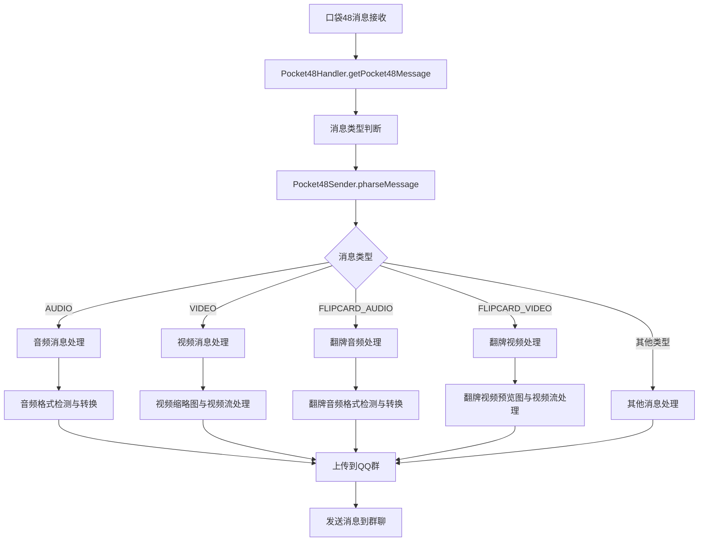
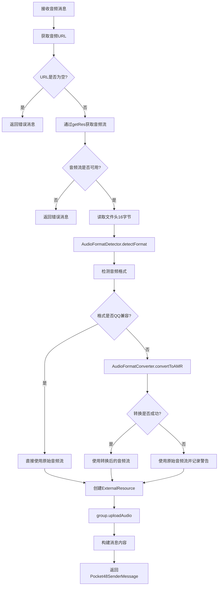
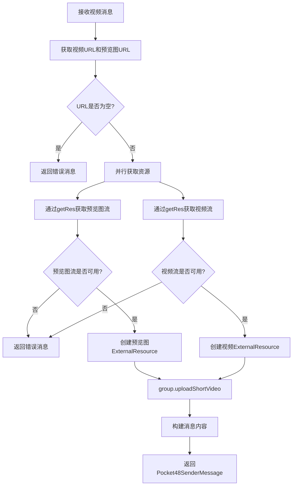
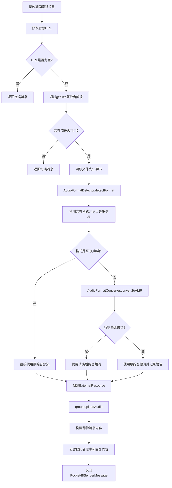
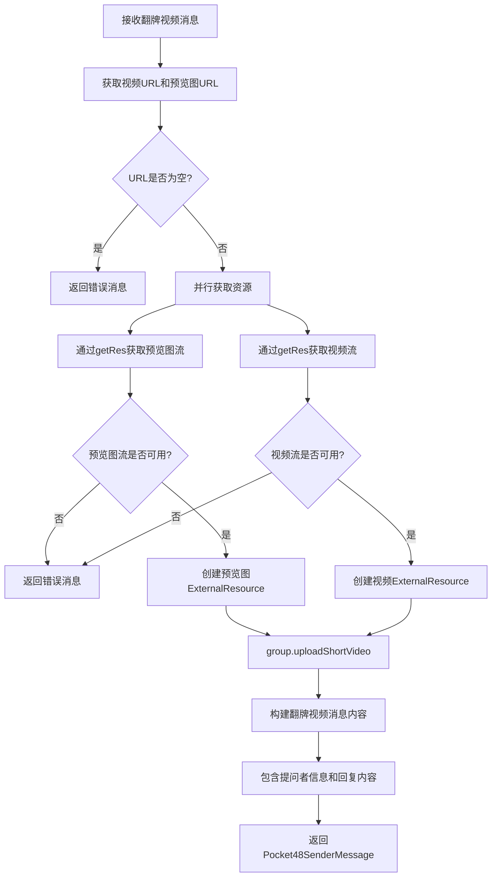
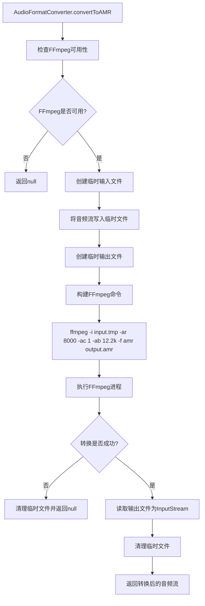
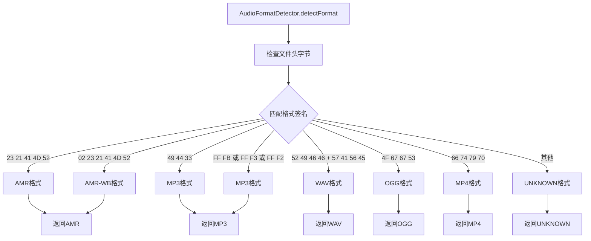

# 口袋48视频和语音消息处理流程图

## 整体架构流程

## 音频消息处理详细流程

## 视频消息处理详细流程

## 翻牌音频处理详细流程

## 翻牌视频处理详细流程

## 音频格式转换详细流程

## 音频格式检测流程

## 关键组件说明

### 1. 核心处理类
- **Pocket48Sender**: 主要的消息解析和发送类
- **Pocket48Handler**: 消息获取和预处理
- **AudioFormatConverter**: 音频格式转换工具
- **AudioFormatDetector**: 音频格式检测工具
- **Pocket48ResourceHandler**: 资源流获取处理

### 2. 支持的音频格式
- **兼容格式**: AMR, AMR-WB, SILK
- **需转换格式**: MP3, WAV, OGG, MP4等
- **转换目标**: AMR格式 (8kHz, 单声道, 12.2kbps)

### 3. 视频处理特点
- 需要同时处理视频文件和预览图
- 支持翻牌视频的特殊格式
- 自动生成文件名包含时间戳

### 4. 错误处理机制
- URL验证
- 资源流可用性检查
- 格式转换失败回退
- 详细的错误日志记录

### 5. 性能优化
- 并行获取视频和预览图资源
- 临时文件自动清理
- 流式处理避免内存溢出